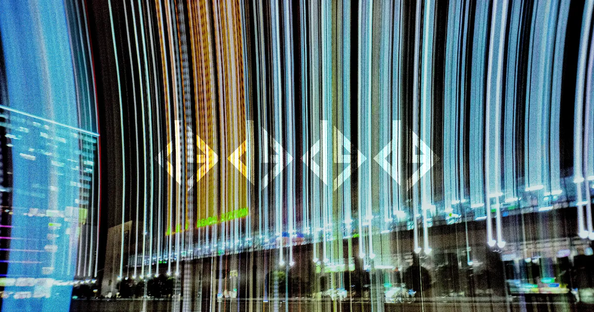

<div align="center">

# dgdgdgdg.com

**https://dgdgdgdg.com**



<br>


<br>

[English](README.md) | **日本語**

</div>

---

## 🚀 概要

Astro と Cloudflare Pages で構築された個人サイト **dgdgdgdg.com** のソースコードです。コンテンツ管理に Notion API を利用しており、動的かつ簡単に更新できるサイトを実現しています。

## ⚡ クイックスタート

### 前提条件
- [Bun](https://bun.sh/) (最新版)

### インストールと実行

```bash
# 依存関係のインストール
bun install

# 開発サーバーの起動
bun run dev
```

## 🔐 環境変数

[dotenvx](https://dotenvx.com/) で管理しています。

```bash
# 1. テンプレートをコピー
cp .env.example .env

# 2. .env に実際の値を設定
vi .env

# 3. 暗号化 (.env.keys が生成されます)
npx dotenvx encrypt
```

> [!IMPORTANT]
> `.env.keys` にある `DOTENV_PRIVATE_KEY` をローカル環境変数または CI/CD のシークレットに設定してください。

## 🛠 プロジェクト構成

```bash
src/
├── components/    # 再利用可能な UI コンポーネント
├── layouts/       # ページレイアウト
├── lib/           # ユーティリティ・Notion API クライアント
├── pages/         # ファイルベースルーティング
└── styles/        # グローバルスタイル (Sass)
```

## 📜 スクリプト

| コマンド | 説明 |
| :--- | :--- |
| `bun run dev` | 開発サーバーを起動 |
| `bun run build` | プロダクションビルド |
| `bun run preview` | ビルド結果をローカルでプレビュー |
